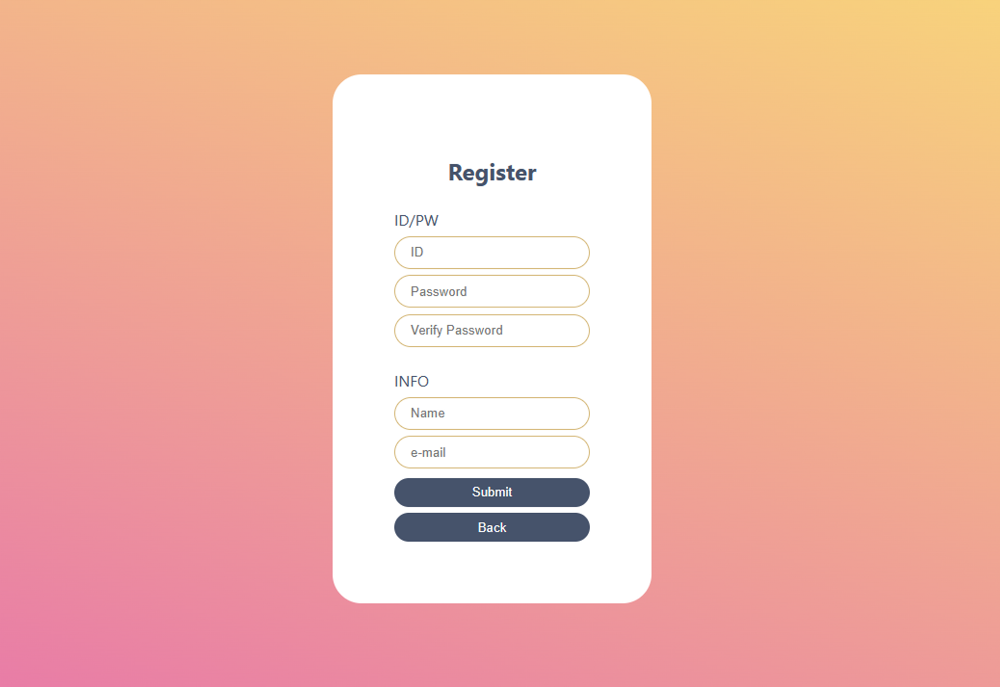

# Team_BC

team_bc

<!-- PROJECT SHIELDS -->
<!--
*** I'm using markdown "reference style" links for readability.
*** Reference links are enclosed in brackets [ ] instead of parentheses ( ).
*** See the bottom of this document for the declaration of the reference variables
*** for contributors-url, forks-url, etc. This is an optional, concise syntax you may use.
*** https://www.markdownguide.org/basic-syntax/#reference-style-links
-->


<!-- TABLE OF CONTENTS -->
## Table of Contents

* [1. About the Project](#about-the-project)
  * [Built With](#built-with)
* [2. Getting Started](#getting-started)
* [3. UI](#ui)
* [4. Service](#service)
* [5. Database](#database)


<!-- ABOUT THE PROJECT -->
## 1. About The Project
[:house:](#table-of-contents)


* 회원가입을 통해 계정을 등록하고, 등록된 계정정보로 로그인하여 게시글 및 댓글을 작성하고 수정/삭제할 수 있는 게시판 서비스입니다. 

### Built With
This section should list any major frameworks that you built your project using. Leave any add-ons/plugins for the acknowledgements section. Here are a few examples.

* [PostgreSQL]
* [Flask]
* [React.js]
* [Docker]

---

<!-- GETTING STARTED -->
## 2. Getting Started
[:house:](#table-of-contents)

This is an example of how you may give instructions on setting up your project locally.
To get a local copy up and running follow these simple example steps.

### Prerequisites

This is an example of how to list things you need to use the software and how to install them.
* TBD
```sh
TBD
```

---

<!-- UI -->
## 3. UI
[:house:](#table-of-contents)

### localhost:port/

> ### Login page


> ### Register page



> ### Board Page


> ### Article Page


> ### Posting Page


---

<!-- SERVICE -->
## 4. Service
[:house:](#table-of-contents)

 1. 회원가입을 통한 계정 등록
 2. 등록된 계정정보로 로그인
 3. 게시판에 게시글 작성 및 열람
 4. 게시글 및 댓글 작성 후 수정/삭제

### Service API

* 	페이지 조회 : [GET] svc_container:port/board?page=<페이지번호> → 특정 페이지의 글 목록 JSON
	
  >	input : page(페이지 번호)
  >	
  >	logic : ORM 객체의 get_page() 메서드의 실행
  >	
  >	output : {success : True/False, data : [{title : 글1제목, uploader : 글1글쓴이, timestamp : 글1시간},{title : 글2제목, uploader : 글2글쓴이, timestamp : 글2시간}, …] , maxPage : 전체 페이지 개수 }
	
* 	글 호출 : [POST] svc_container:port/article?aid=<글번호> → 특정 글의 내용 JSON 반환
	
  >	input : aid (글 고유 번호)
  >	
  >	logic : ORM 객체의 get_article() 메서드의 실행
  >	
  >	output : {success : True/False, data : {title : 제목, uploader : 글쓴이, article : 본문내용}
	
* 	글 게재 : [POST] svc_container:port/article → 글 게재 성공 여부 JSON
	
  >	input : jsonBodyData (글 게재 API로의 POST 요청 결과 )
  >	
  >	logic : json 데이터를 ORM 객체의 post_article()로 전달하여 처리
  >	
  >	output : {success : True/False}
	
* 	글 수정 : [PATCH] svc_container:port/article → 글 수정 성공 여부 JSON
	
  >	input : jsonBodyData (글 수정 API로의 PATCH 요청 결과 ) {}
  >	
  >	logic : json 데이터를 ORM 객체의 edit_article()로 전달하여 처리
  >	
  >	output : {success : True/False}
	
* 	글 삭제 : [DELETE] svc_container:port/article?aid=<글 번호> → 글 삭제 성공 여부
	
  >	input : aid (글 고유 번호)
  >	
  >	logic : ORM 객체의 delete_article() 메서드 실행
  >	
  >	output : {success : True/False}
	
* 	댓글 호출 : [GET] svc_container:port/article?aid=<글번호>/reply
	
  >	input : aid (글 고유 번호)
  >	
  >	logic : ORM 객체의 get_reply() 메서드 실행
  >	
  >	output : {success : True/False, data : [{reply : 댓글1, uploader : 댓글1글쓴이},{reply : 댓글2, uploader : 댓글2글쓴이}, … ] }
	
* 	댓글 게재 : [POST] svc_container:port/article?aid=<글번호>/reply
	
  >	input : aid (글 고유 번호), 사용자 정보, jsonBodyData (댓글 게재 API의 POST 요청 결과)
  >	
  >	logic : aid (글 고유 번호), 사용자 정보를 포함한 데이터를 JSON화 하여 ORM 객체의 post_reply()로 보내서 처리
  >	
  >	output : {success : True/False}
	
* 	댓글 수정 : [PATCH] svc_container:port/article?aid=<글번호>/reply
	
  >	input : jsonBodyData (댓글 게재 API의 PATCH 요청 결과)
  >	
  >	logic : 수정이 이루어진 데이터를 JSON화 하여 ORM 객체의 edit_reply()로 보내서 처리
  >	
  >	output : {success : True/False}
	
* 	댓글 삭제 : [DELETE] svc_container:port/article?aid=<글번호>/reply?rid=<댓글번호>
	
  >	input : aid (글 고유 번호), rid (댓글 고유 번호), 로그인 정보
  >	
  >	logic : 삭제할 글 번호와 로그인 정보를 대조해서 삭제할 권한이 있는지 확인 후 (UI / SVC 단에서 처리) ORM 객체에 delete_reply()에 요청하여 처리
  >	
  >	output : {success : True/False}

---

<!-- DATABASE -->
## 5. Database 
[:house:](#table-of-contents)

  ### DB Scheme

* UserInfo

| id | password | email | name |
| :---: | :---: | :---: | :---: |
| VARCHAR (40) | VARCHAR (40) | VARCHAR (40) | VARCHAR (40) |
| NOT NULL | NOT NULL | NOT NULL | NOT NULL |
| PK |

* ArticleInfo

| aid | title | uploader | timestamp | article |
| :---: | :---: | :---: | :---: | :---: |
| INT | VARCHAR (80) | VARCHAR(40) | DateTime | VARCHAR(6000) |
| AUTO INCREMENT | NOT NULL |
| NOT NULL |
| PK | 

* CommentInfo

| rid | aid | reply | uploader | timestamp |
| :---: | :---: | :---: | :---: | :---: |
| INT | INT | VARCHAR (600) | VARCHAR(40) | DateTime |
| AUTO INCREMENT | NOT NULL | NOT NULL |
| NOT NULL |
| PK | 

  ### ORM Method
	
* 	글 내용 호출 : get_article(articleID) → 특정 글의 데이터 JSON
	
  >	input : articleID (글 고유 번호)
  >	
  >	logic : session.query() 로 특정 글을 호출, json화 해서 반환
  >	
  >	output : {success : True/False, data : {title : 제목, uploader : 글쓴이, article : 본문}
	
* 	글 게재 : post_article(jsonBodyData) → 글 게재 수행 결과 JSON
	
  >	input : jsonBodyData (글 게재 API의 POST 요청 결과 )
  >	
  >	logic : json 데이터로부터 값들을 받아 새 값 입력
  >	
  >	output : {success: True/False글 수정 : edit_article(jsonBodyData) → 글 수정 수행 결과 JSON
	
* 	글 수정 : edit_article(jsonBodyData) → 글 수정 수행 결과 JSON
	
  >	input : jsonBodyData (글 수정 API의 PATCH 요청 결과 )
  >	
  >	logic : json 데이터로부터 값들을 받아 새 값 입력
  >	
  >	output : {success: True/False}
	
* 	글 삭제 : delete_article(articleID) → 글 삭제 수행 결과 JSON
	
  >	input : articleID (글 고유 번호)
  >	
  >	logic : session.query()로 고유 번호의 글 삭제, 해당 글에 달린 댓글들 삭제
  >	
  >	output : {success: True/False}
	
* 	댓글 호출 : get_reply(articleID) → 특정 글에 달린 댓글들 JSON 반환
	
  >	input : articleID (글 고유 번호)
  >	
  >	logic : session.query()로 글 고유 번호에 달린 댓글들을 수집 및 반환
  >	
  >	output : {success : True/False, data : [{reply : 댓글1, uploader : 댓글1글쓴이},{reply : 댓글2, uploader : 댓글2글쓴이}, … ] }
	
* 	댓글 게재 : post_reply(articleID, jsonBodyData)
	
  >	input : articleID (글 고유 번호), jsonBodyData (댓글 게재 API의 POST 요청 결과 )
  >	
  >	logic : json 데이터로부터 값들을 받아 session.add()로 새 값 입력
  >	
  >	output : {success: True/False}
	
* 	댓글 수정 : edit_reply(jsonBodyData)
	
  >	input : jsonBodyData (댓글 수정 API의 PATCH 요청 결과 )
  >	
  >	logic : json 데이터로부터 값들을 받아 수정된 값을 입력
  >	
  >	output : {success: True/False}
	
* 	댓글 삭제 : delete_reply(rID)
	
  >	input : rid (댓글 고유 번호)
  >	
  >	logic : session.query()로 댓글 고유 번호로 엔티티를 찾아 댓글 삭제
  >	
  >	output : {success: True/False}
  
---

참고자료
https://www.notion.so/t3q/Team-B-C-group-b0dcef8a4bdc448985c2d1db0fbbe24d
